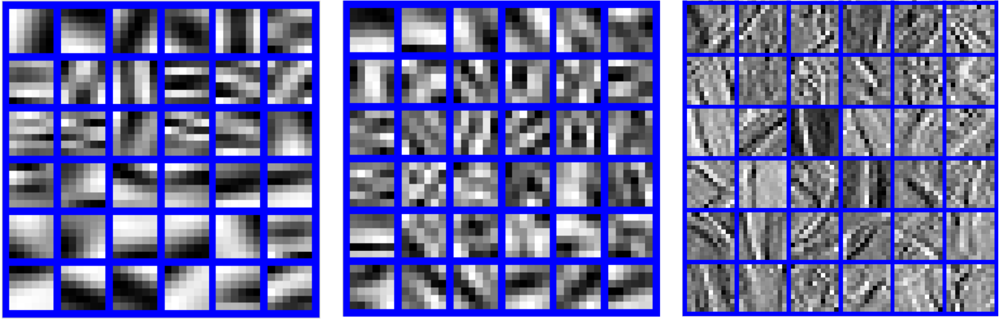

# GradCSC
Convolutional Sparse Coding in Gradient Domain for MRI Reconstruction  

The Code is created based on the method described in the following papers:   
[1] J. Xiong , H. Lu , M. Zhang , Q. Liu, Convolutional Sparse Coding in Gradient Domain for MRI Reconstruction,ACTA AUTOMATICA SINICA,43(10):1841-1849, 2017.  
Author: J. Xiong , H. Lu , M. Zhang , Q. Liu   
Date : 4//2018   
Version : 1.0   
The code and the algorithm are for non-comercial use only.   
Copyright 2018, Department of Electronic Information Engineering, Nanchang University.   
GradCSC - Convolutional sparse coding in Gradient domain  

Gradientfilters_mri.mat is available at: https://pan.baidu.com/s/1f7tlnFeySu1UNjLtzfVasg. 

## Visual illustration of learned dictionary/filters.

 
Left: Learned dictionary by DLMRI. Middle: Learned dictionary by GradDL. Right: Learned filters by GradCSC.

## Other Related Projects
  * Predual dictionary learning (PDL) / augmented Lagrangian multi-scale dictionary learning(ALM-DL) [**[Paper]**](http://www.escience.cn/people/liuqiegen/index.html;jsessionid=5E20FEE3694E8BB3249B64202A8E25C8-n1)   [**[Code]**](https://github.com/yqx7150/PDL_ALM_DL_code) 
    
  * Adaptive dictionary learning in sparse gradient domain for image recovery [**[Paper]**](https://ieeexplore.ieee.org/document/6578193/)   [**[Code]**](https://github.com/yqx7150/GradDL) 
  
  * Field-of-Experts Filters Guided Tensor Completion [**[Paper]**](https://ieeexplore.ieee.org/document/8291751/similar#similar)   [**[Code]**](https://github.com/yqx7150/FoE_STDC)
  
  * Synthesis-analysis deconvolutional network for compressed sensing [**[Paper]**](https://ieeexplore.ieee.org/document/8296620)   [**[Code]**](https://github.com/yqx7150/SADN)
       
  * Sparse and dense hybrid representation via subspace modeling for dynamic MRI [**[Paper]**](https://www.sciencedirect.com/science/article/abs/pii/S089561111730006X)   [**[Code]**](https://github.com/yqx7150/SDR)
